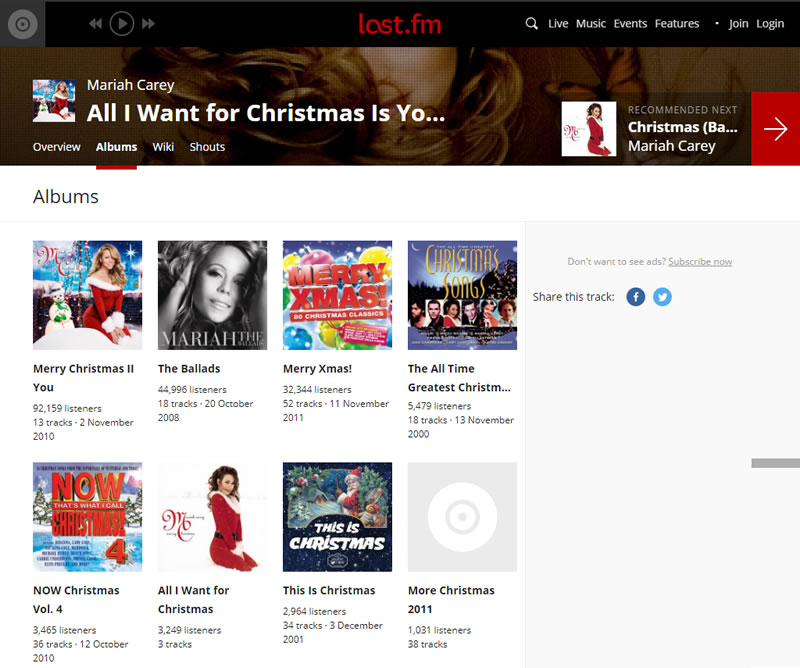
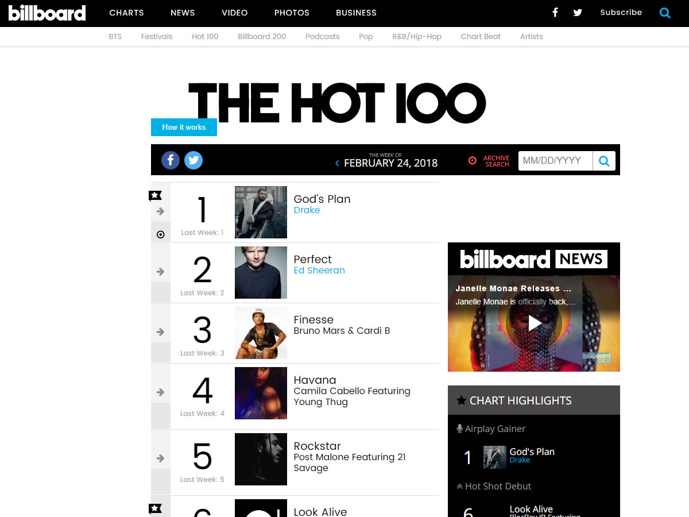
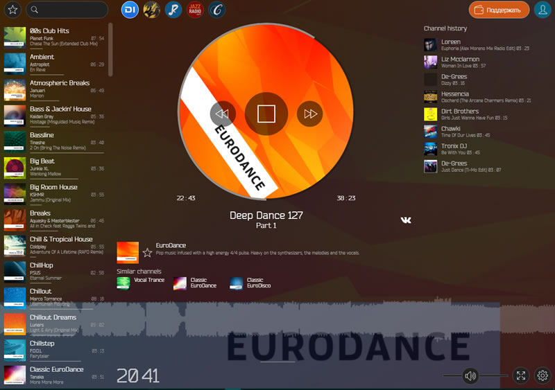
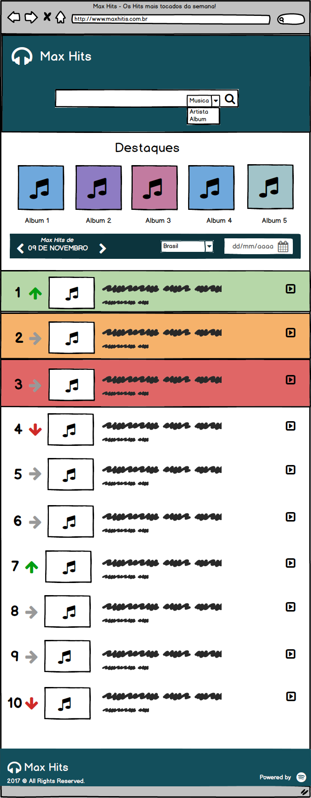
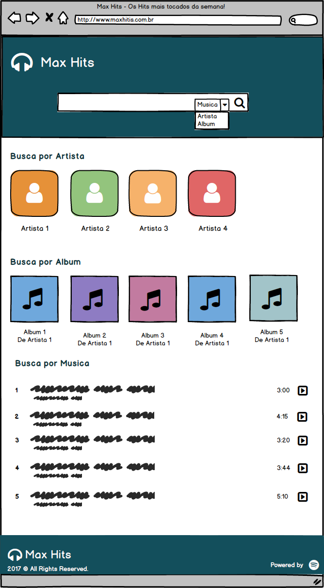
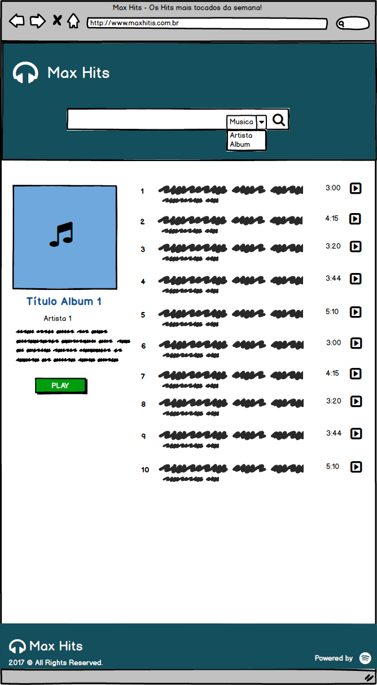
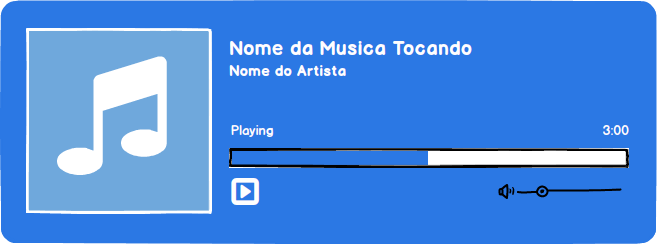

# MAX HITS

## Descrição
Aplicação web que utiliza a API do Last.fm para listar os Hits Eletrônicos mais tocados no mundo e no Brasil, além de permitir ao usuário buscar por músicas, álbuns ou seus artistas preferidos escutando um bom hit eletrônico!

## Objetivo
Aplicação criada para os amantes de Hits Eletrônicos que buscam se atualizar sobre os artistas, sobre as musicas e sobre os álbuns mais tocados nas paradas do Mundo e do Brasil.

## Funcionalidades
- Listar os hits de músicas, artistas e álbuns por ritmos 
- Listar os hits de músicas e  artistas por países
- Exibir informações das mídias listadas
- Procurar por mídias a partir de um campo de busca
- Tocar stream de musica de ritmos específicos

## Recursos da API
Foi utilizada a API do [Last FM](https://last.fm/api) para as requisições das mídias. Também foi utilizado o webservice da radio [DI FM](https://www.di.fm) para streaming de músicas.

## Requisitos
### Bibliotecas
- [jQuery ^3.3.1]
- [Bootstrap 3.3.7]

### Plugins
- [Alertifyjs ^1.11.0](http://alertifyjs.com)
- [Font-awesome ^4.7.0](https://fontawesome.com)
- [jPlayer 2.9.2](http://www.jplayer.org)
- [Icon Select 1.0](http://www.bugraozden.com)
- [Itemslide 1.3.0](http://itemslide.github.io)
- [Lity ^2.3.0](http://sorgalla.com/lity/)
- [Nice Select 1.1.0](http://hernansartorio.com/jquery-nice-select/)
- [Vegas ^2.4.0](http://vegas.jaysalvat.com)

## Instalação
Foi utilizado o webpack para geração do bundle.js, bundle.css utilizando os módulos babel-loader, file-loader, extract-loader, css-loader, postcss-loader e sass-loader

## Inspirações
### [Last FM](https://www.last.fm/)
 

### [Billboard](http://www.billboard.com/charts/hot-100)

### [Nonstopplay](http://www.nonstopplay.com/)

### [Hqradio](https://hqradio.ru/)

## Protótipos
#### Index

#### Resultado da busca

#### Informações das mídias

#### Player de música

## Contato
Gesoaldo Guimarães | gesoaldo.guimaraes@academico.ifpb.edu.br

